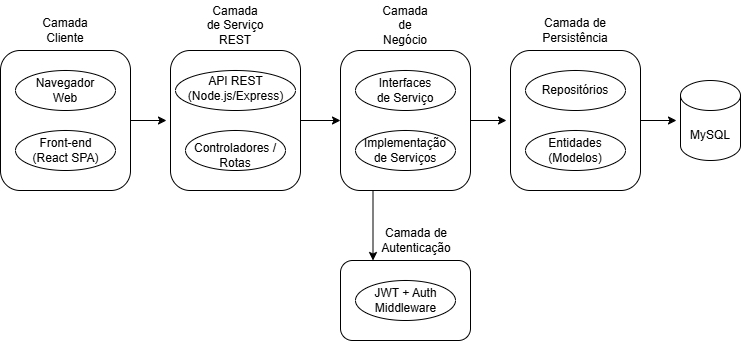
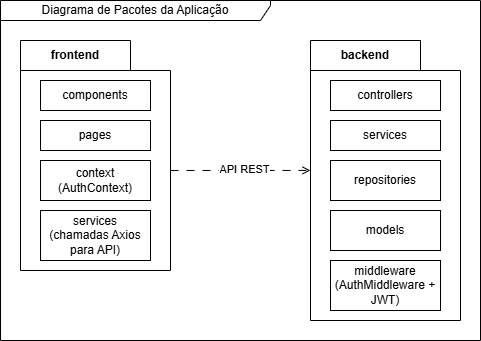
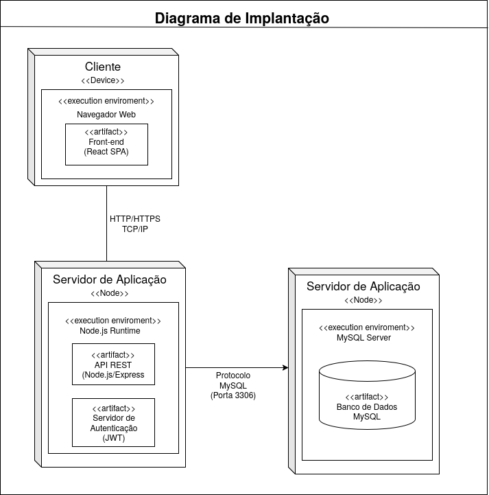
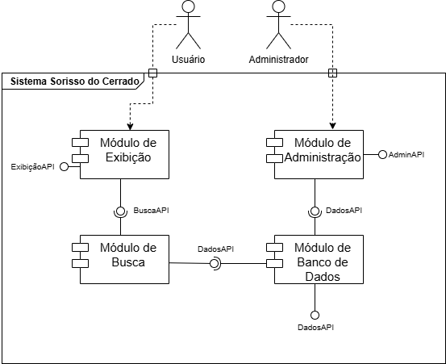

# Diagramas de Arquitetura

Esta seção consolida os diagramas estruturais que representam a arquitetura lógica, a divisão de pacotes, os nós de implantação física e os componentes visuais do **Sorriso do Cerrado**.

---

## 1. Diagrama de Camadas da Aplicação
Demonstra a hierarquia e o sentido de comunicação entre as camadas: Apresentação (React SPA), Serviços REST (Express), Regras de Negócio e Persistência (MySQL).

* [Baixar editável (.drawio)](../assets/diagramas/6-arquitetura/1-CamadasAplicacao.drawio)

---

## 2. Diagrama de Pacotes da Aplicação
Organização dos diretórios e módulos internos do projeto em dois grandes ecossistemas: `web` (front-end e controladores) e `core` (serviços, entidades e repositórios).

* [Baixar editável (.drawio)](../assets/diagramas/6-arquitetura/2-PacotesAplicacao.drawio)

---

## 3. Diagrama de Implantação Física (Deployment)
Configuração dos nós físicos e ambientes de execução: Máquina Cliente executando o Navegador Web, Servidor Node.js executando a API REST e Servidor de Banco de Dados MySQL 8.0.

* [Baixar editável (.drawio)](../assets/diagramas/6-arquitetura/3-Implantacao.drawio)

---

## 4. Diagrama de Componentes de Interface
Mapeamento dos componentes React reutilizáveis que compõem o ecossistema visual da aplicação: Navbar, Footer, ProductCard, CartDrawer, HeroBanner e formulários de cadastro.

* [Baixar editável (.drawio)](../assets/diagramas/7-interfaces/1-Componentes.drawio)
