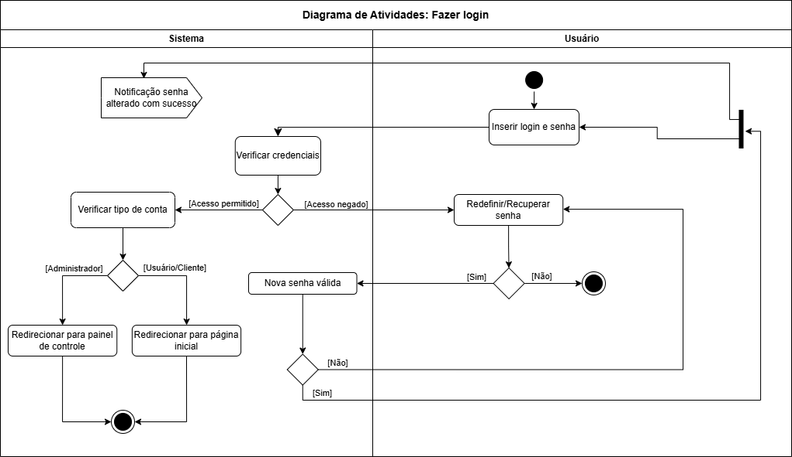
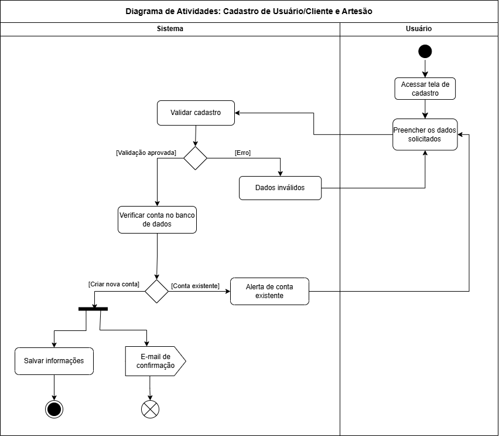
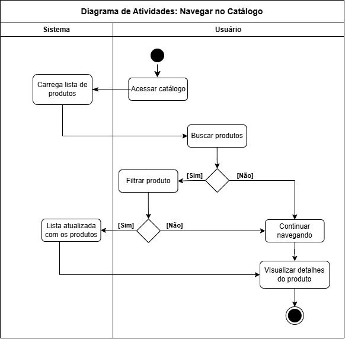
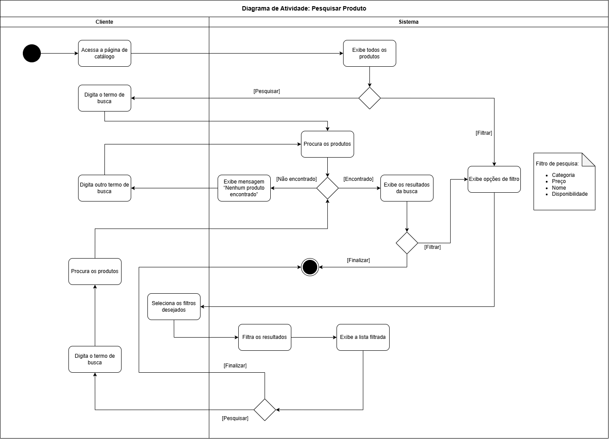
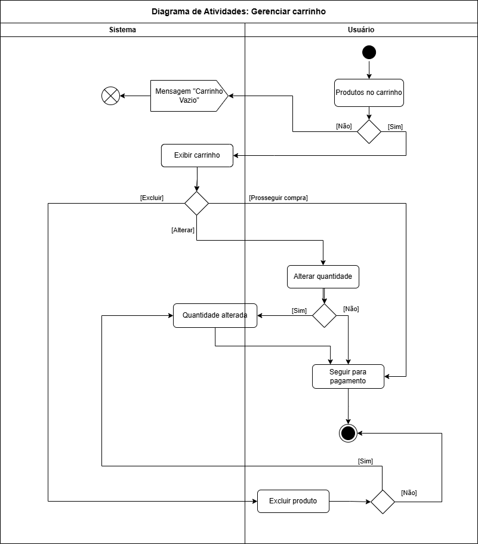
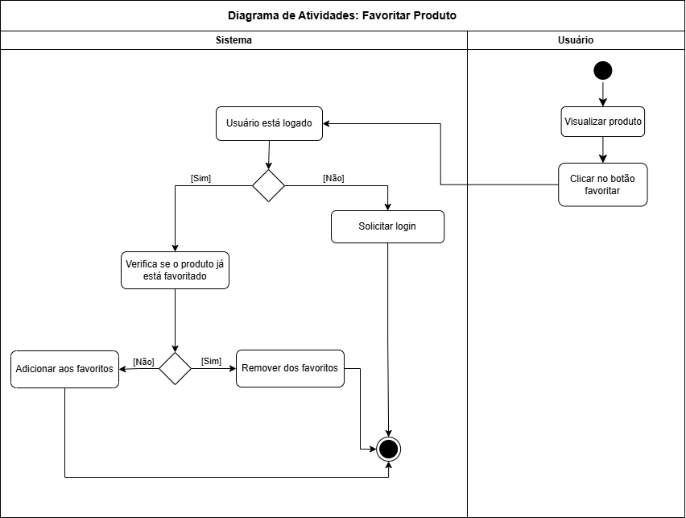
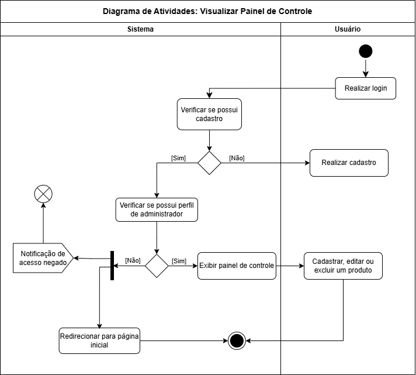
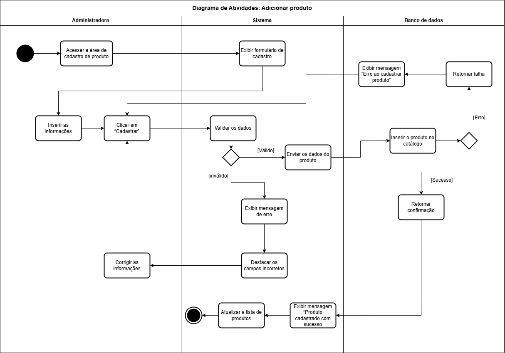
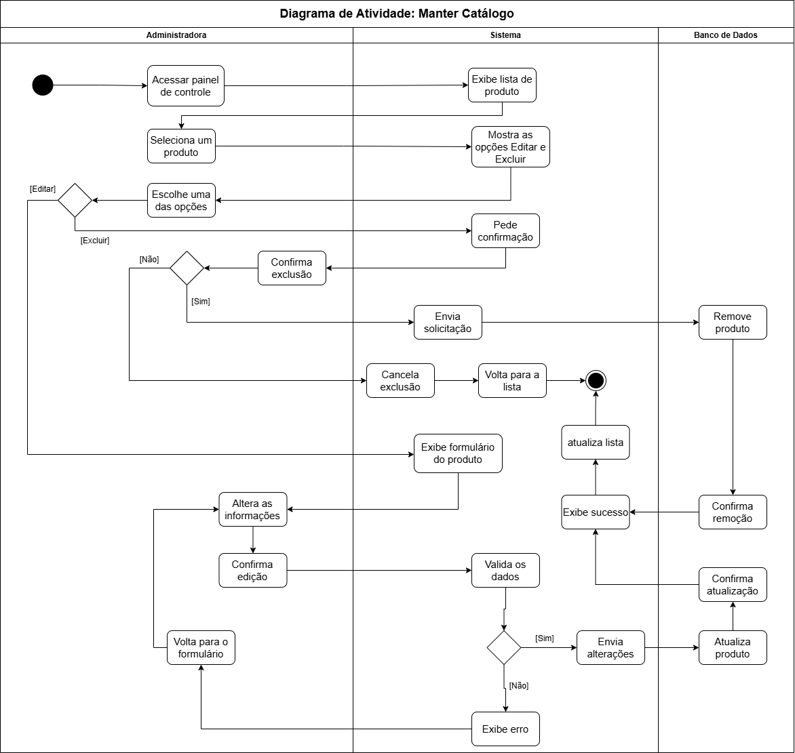
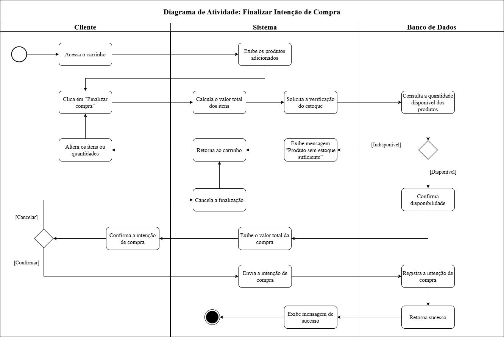

# Diagramas de Atividades

Os diagramas de atividades modelam a lógica operacional e a sequência temporal de ações de cada caso de uso do sistema, contemplando nós de decisão, caminhos alternativos e tratamento de erros.

---

## 1. Fazer Login (UC001)
Validação de credenciais de e-mail e senha, diferenciação entre perfis de cliente e administrador e redirecionamento de tela.

* [Baixar editável (.drawio)](../assets/diagramas/3-diagramas-de-atividades/1-FazerLogin.drawio)

---

## 2. Cadastro de Cliente e Artesão (UC002)
Fluxo de preenchimento, validação de campos, verificação de duplicidade de e-mail e persistência no banco.

* [Baixar editável (.drawio)](../assets/diagramas/3-diagramas-de-atividades/10-CadastroCliente_Artesao.drawio)

---

## 3. Navegar no Catálogo (UC004)
Consulta ao acervo de produtos, requisição à API e renderização dos cards na tela.

* [Baixar editável (.drawio)](../assets/diagramas/3-diagramas-de-atividades/2-NavegarCatalogo.drawio)

---

## 4. Pesquisar Produto (UC005)
Captura do termo digitado pelo usuário, filtragem em tempo real e exibição dos resultados correspondentes ou aviso de não encontrado.

* [Baixar editável (.drawio)](../assets/diagramas/3-diagramas-de-atividades/8-PesquisarProduto.drawio)

---

## 5. Gerenciar Carrinho de Compras (UC006)
Inclusão de peças, alteração de quantidades, remoção de itens e recálculo dinâmico dos valores.

* [Baixar editável (.drawio)](../assets/diagramas/3-diagramas-de-atividades/3-GerenciarCarrinho.drawio)

---

## 6. Favoritar Produto (UC009)
Verificação de login, checagem do estado atual do produto e inclusão/remoção na base de dados de favoritos.

* [Baixar editável (.drawio)](../assets/diagramas/3-diagramas-de-atividades/6-FavoritarProduto.drawio)

---

## 7. Visualizar Painel de Controle (UC003)
Autenticação de administrador, checagem de autorização e carregamento da tabela de estoque e produtos.

* [Baixar editável (.drawio)](../assets/diagramas/3-diagramas-de-atividades/4-PainelControle.drawio)

---

## 8. Adicionar Novo Produto (UC010a)
Preenchimento do formulário pela artesã, envio de dados e imagem, validação e persistência no MySQL.

* [Baixar editável (.drawio)](../assets/diagramas/3-diagramas-de-atividades/5-AdicionarProduto.drawio)

---

## 9. Manter Catálogo (UC010b)
Operações de atualização cadastral e exclusão de produtos com confirmação de segurança.

* [Baixar editável (.drawio)](../assets/diagramas/3-diagramas-de-atividades/7-ManterCatalogo.drawio)

---

## 10. Finalizar Intenção de Compra (UC008)
Verificação de disponibilidade em estoque, consolidação de totais e integração com o canal de atendimento no WhatsApp.

* [Baixar editável (.drawio)](../assets/diagramas/3-diagramas-de-atividades/9-FinalizarIntencaoCompra.drawio)
