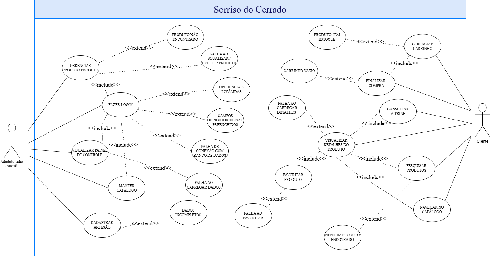

# Diagrama Geral de Casos de Uso

O Diagrama de Casos de Uso representa a visão global do sistema sob a ótica dos atores externos, evidenciando as funcionalidades oferecidas e suas relações de dependência (`<<include>>` e `<<extend>>`).

---

## Diagrama UML

---

## Atores do Sistema

1. **Cliente / Visitante:**
    * Navega pelo catálogo e vitrine de produtos.
    * Realiza buscas e visualiza páginas de detalhes.
    * Adiciona e gerencia itens no carrinho de compras.
    * Salva produtos na lista de favoritos.
    * Conclui a intenção de compra.
    * Cria conta de usuário e realiza autenticação.
2. **Administradora (Artesã Dona Ângela):**
    * Realiza autenticação com privilégios administrativos.
    * Acessa o Painel de Controle de Estoque.
    * Cadastra novos artesanatos com fotos, estoque e valor.
    * Edita dados e fotos de produtos existentes.
    * Exclui itens do catálogo quando descontinuados.

---

## Arquivo Editável
* [Baixar arquivo editável (.drawio)](../assets/diagramas/1-casos-de-uso/1-CasosdeUso.drawio)
