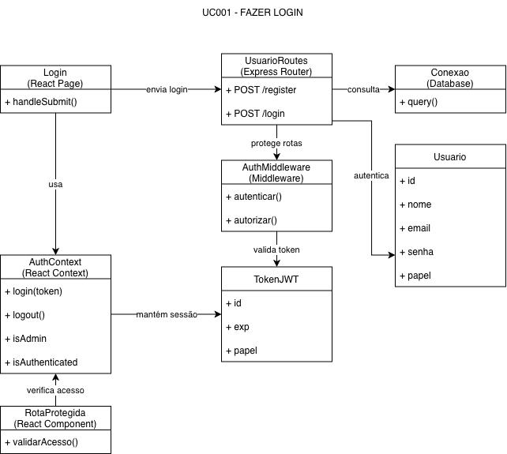
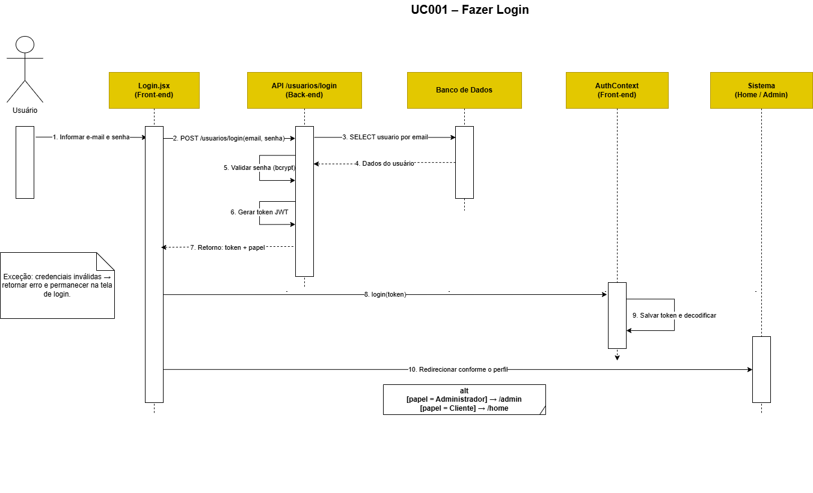

# Diagramas de Classes e Sequência

A modelagem estática e comportamental do sistema aprofunda o funcionamento técnico das rotas mais críticas da aplicação, com ênfase especial na **Autenticação e Sessão (UC001)**.

---

## 1. Diagrama de Classes — Autenticação e Login (UC001)

O Diagrama de Classes abaixo mapeia as entidades, componentes React, rotas Express, middlewares de segurança e estruturas de persistência que tornam viável o processo de login seguro e controle de acesso por papéis.

### Principais Componentes e Responsabilidades:
* `LoginPage`: Componente visual React responsável pela captura de e-mail e senha e validação preliminar de interface.
* `AuthContext`: Provedor de contexto global no front-end que armazena em memória o estado do usuário logado, token JWT e papéis (`isAdmin`).
* `UsuarioRoutes`: Roteador do Express expondo os endpoints `/login`, `/cadastro`, `/usuarios`.
* `AuthMiddleware`: Interceptador de requisições que extrai e decodifica o token JWT presente no cabeçalho `Authorization: Bearer <token>`.
* `Usuario (Entidade / Repositório)`: Mapeamento da tabela de dados relacionais com os métodos de consulta (`buscarPorEmail`) e inserção.

---

## 2. Diagrama de Sequência — Autenticação e Login (UC001)

O Diagrama de Sequência ilustra a troca de mensagens ao longo do tempo entre o usuário, os módulos front-end, a API back-end e o banco de dados durante a operação de login.

### Etapas do Fluxo:
1. O usuário preenche credenciais e clica em *"Entrar"*.
2. O `LoginPage` despacha uma requisição HTTP `POST /login` para o back-end com o payload JSON contendo e-mail e senha.
3. O controlador consulta o banco de dados MySQL para buscar o usuário cadastrado pelo e-mail informado.
4. Caso o registro seja encontrado, o sistema compara o hash da senha fornecida com o hash armazenado utilizando `bcrypt`.
5. Com a validação positiva, o servidor gera o token assinado via JWT contendo `id`, `email` e perfil `isAdmin`.
6. O servidor responde com código HTTP 200 (OK) e o payload contendo o token e os dados básicos do usuário.
7. O front-end salva o token no `localStorage`, atualiza o `AuthContext` e redireciona o usuário (para o painel administrativo se for artesã ou para a home se for cliente).

* [Baixar editável do Diagrama de Sequência (.drawio)](../assets/diagramas/5-diagramas-de-sequencia/1-SequenciaLogin.drawio)
