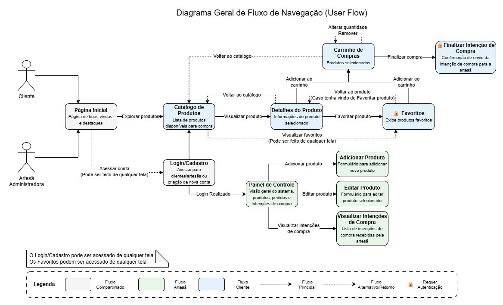
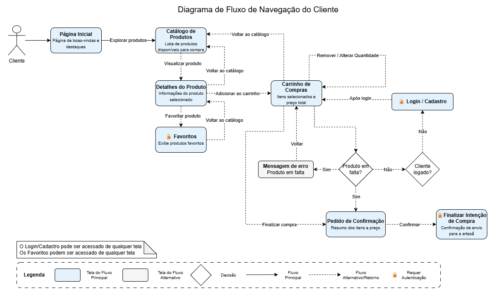
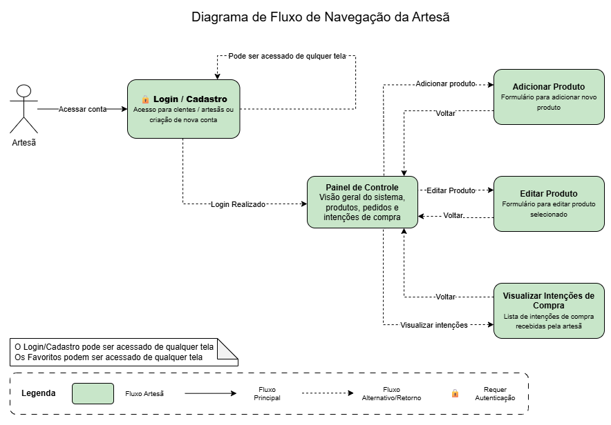
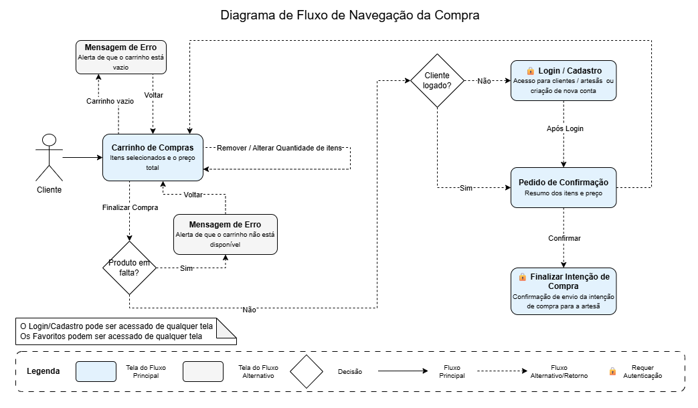

# Fluxos de Navegação (User Flows)

Os diagramas de fluxo de navegação mapeiam a jornada do usuário entre as diferentes páginas e estados da aplicação, demonstrando a fluidez e a coerência da experiência de navegação (UX).

---

## 1. Fluxo Geral de Navegação
Visão unificada das conexões entre a página inicial, catálogo, autenticação, carrinho e módulo administrativo.

* [Baixar arquivo editável (.drawio)](../assets/diagramas/2-fluxos-de-navegacao/1-FluxoGeral.drawio)

---

## 2. Fluxo do Cliente
Representa o caminho percorrido pelo cliente desde a chegada à vitrine virtual até a exploração de detalhes e inclusão de itens em favoritos.

* [Baixar arquivo editável (.drawio)](../assets/diagramas/2-fluxos-de-navegacao/2-FluxoCliente.drawio)

---

## 3. Fluxo da Artesã (Administradora)
Mapeia o ciclo de gestão da dona da loja: login com credenciais restritas, acesso ao painel de inventário, cadastro e edição de produtos.

* [Baixar arquivo editável (.drawio)](../assets/diagramas/2-fluxos-de-navegacao/3-FluxoArtesa.drawio)

---

## 4. Fluxo de Compra e Carrinho
Detalha o percurso transacional: seleção de produtos, revisão no carrinho, cálculo de totais e finalização da intenção de compra via WhatsApp.

* [Baixar arquivo editável (.drawio)](../assets/diagramas/2-fluxos-de-navegacao/4-FluxoCompra.drawio)
