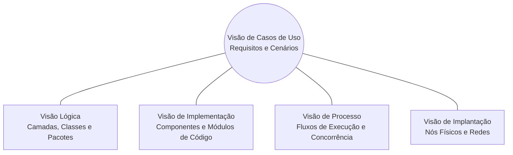

# Documento de Arquitetura de Software

**Versão:** 1.0  
**Data:** 18/04/2026  
**Autores:** Samantha Yumi Tanaka, Vinicios Trindade Costa, Pedro Henrique Cavalcante, Samuel Batista Rennó, Wictor Emanoel Ponte Menezes.  
**Modelo Teórico Adotado:** Modelo de Visões Arquiteturais "4+1" de Philippe Kruchten.

---

## 1. Representação Arquitetural (Modelo 4+1)

A documentação arquitetural do **Sorriso do Cerrado** está estruturada de acordo com o consagrado modelo 4+1, garantindo que diferentes partes interessadas (*stakeholders*) compreendam o sistema sob suas perspectivas específicas:

| Visão | Público Principal | Foco Principal | Artefatos Gerados |
| :--- | :--- | :--- | :--- |
| **Casos de Uso** | Todos os stakeholders | Requisitos funcionais e comportamento externo | Diagrama Geral de Casos de Uso e especificações |
| **Lógica** | Analistas e Arquitetos | Estrutura estática de classes, camadas e pacotes | Diagrama de Camadas e Diagrama de Pacotes |
| **Implementação** | Desenvolvedores | Módulos de código, arquivos fonte e componentes | Diagrama de Classes (UC001) e Componentes |
| **Processo** | Integradores e DevOps | Ciclo temporal de mensagens e concorrência | Diagrama de Sequência (Login / JWT) |
| **Implantação** | Administradores de Infra | Nós físicos, contêineres e topologia de rede | Diagrama de Implantação Física |

---

## 2. Padrão Arquitetural em Camadas (Layered Architecture)

A aplicação adota o padrão arquitetural em camadas bem delimitadas com responsabilidades desacopladas:

1. **Camada de Apresentação (Client Side / SPA):**
    * Desenvolvida em **React** com **TypeScript** e empacotador **Vite**.
    * Responsável pela renderização reativa, captura de eventos do usuário, validação inicial de formulários e gerenciamento de estado local (`AuthContext`, `CartContext`).
2. **Camada de Serviços e Roteamento (API REST / Back-End):**
    * Desenvolvida em **Node.js** com **Express**.
    * Expõe endpoints RESTful com formato JSON.
    * Middlewares dedicados realizam validação de payloads, tratamento global de erros, suporte a upload de arquivos (*Multer*) e segurança via JWT (`authMiddleware`).
3. **Camada de Regras de Negócio e Controladores:**
    * Isola a lógica operacional do e-commerce (cálculo de descontos, conferência de estoque, geração de tokens e hashes criptográficos).
4. **Camada de Persistência de Dados:**
    * Gerenciada pelo **MySQL Server 8.0**.
    * Tabelas relacionais com chaves primárias e estrangeiras garantindo a integridade transacional de produtos, categorias, usuários e favoritos.

---

## 3. Mecanismos Arquiteturais

| Mecanismo de Análise | Mecanismo de Design | Mecanismo de Implementação |
| :--- | :--- | :--- |
| **Interface do Usuário** | Single Page Application (SPA) | React.js com TypeScript, CSS Modules e React Router |
| **Processamento Servidor** | RESTful Micro-Services / API | Node.js com Express e TypeScript |
| **Persistência de Dados** | Banco de Dados Relacional | MySQL 8.0 com conexões gerenciadas (`mysql2/promise`) |
| **Autenticação e Sessão** | Token Bearer Stateless | JSON Web Token (JWT) com assinatura simétrica secreta |
| **Criptografia de Senhas** | Hash unidirecional com salt | Biblioteca `bcryptjs` |
| **Controle de Versão** | Versionamento distribuído | Git e GitHub |
| **Contêinerização** | Virtualização em nível de SO | Docker e Docker Compose |

---

## 4. Visão de Implantação Física

A topologia de implantação foi projetada para suportar tanto a execução em contêineres locais de desenvolvimento quanto o deploy em nuvem:

* **Nó Cliente (Navegador):** Dispositivos desktop ou móveis executando navegadores modernos (Chrome, Edge, Firefox, Safari) consumindo os arquivos estáticos compilados da SPA.
* **Nó de Aplicação (Servidor Web / API Node.js):** Contêiner Linux executando a runtime Node.js, escutando requisições HTTP na porta configurada (ex.: `:3000`), responsável pelo processamento da lógica de negócio.
* **Nó de Dados (Banco de Dados MySQL):** Contêiner gerenciando o serviço MySQL 8.0 na porta dedicada (ex.: `:3307`), com armazenamento persistente via volumes Docker.

---

## 5. Atributos de Qualidade de Serviço (QoS)

* **Segurança:** As rotas que alteram dados do catálogo (`POST`, `PUT`, `DELETE /produtos`) exigem token JWT válido de usuário administrador. Rotas de favoritos e perfil exigem token de usuário autenticado.
* **Desempenho:** Respostas de leitura da vitrine retornam em milissegundos através do uso de índices nas tabelas e consultas SQL otimizadas.
* **Disponibilidade:** A arquitetura desacoplada permite que front-end e back-end sejam escalados ou reiniciados de forma independente.
