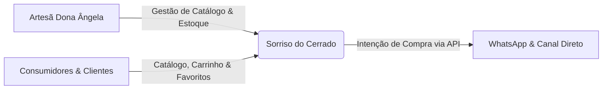

# Sorriso do Cerrado — Documentação do Sistema

Bem-vindo à documentação oficial do projeto **Sorriso do Cerrado**, uma plataforma de comércio eletrônico (*e-commerce*) desenvolvida com foco no artesanato regional e sustentável, promovendo a autonomia digital e a inclusão produtiva de artesãos do Cerrado brasileiro.

---

## Visão Geral do Projeto

O **Sorriso do Cerrado** nasceu como uma iniciativa acadêmica e comunitária desenvolvida por estudantes do curso de **Engenharia de Software** da **Universidade Católica de Brasília (UCB)**. O projeto foi idealizado para atender diretamente às necessidades da artesã **Ângela Maria**, proporcionando um canal digital autônomo, acessível e simplificado para exposição e comercialização de suas peças artesanais em capim dourado e elementos da flora do Cerrado.

### Equipe de Engenharia de Software
* **Pedro Henrique Cavalcante de Sousa**
* **Pedro Henrique Nunes de Freitas**
* **Samantha Yumi Tanaka** (Gestora do Projeto)
* **Samuel Batista Rennó**
* **Vinicios Trindade Costa** (Gerente de Projeto)
* **Wictor Emanoel Ponte Menezes**

**Orientador Acadêmico:** Prof. Alexandre Silva dos Santos  
**Instituição:** Universidade Católica de Brasília (UCB) — Pró-Reitoria Acadêmica

---

## Tecnologias Utilizadas

A solução é construída sob uma arquitetura desacoplada em três camadas, combinando tecnologias consolidadas de mercado:

| Camada | Tecnologia | Função Principal |
| :--- | :--- | :--- |
| **Front-End** | React (TypeScript + Vite) | Single Page Application (SPA) responsiva com foco em acessibilidade e facilidade de navegação. |
| **Back-End** | Node.js (Express + TypeScript) | API RESTful responsável pelas regras de negócio, autenticação JWT e rotas protegidas. |
| **Banco de Dados** | MySQL 8.0 | Banco de dados relacional para persistência íntegra de usuários, produtos, favoritos e pedidos. |
| **Contêineres** | Docker & Docker Compose | Orquestração local para desenvolvimento padronizado e deploy simplificado. |
| **Testes** | Jest & Cypress | Testes unitários para regras de negócio e testes End-to-End (E2E) simulando a experiência do usuário. |

---

## Estrutura da Documentação

A documentação está organizada nas seguintes seções temáticas para navegação rápida:

* [**Engenharia de Software**](engenharia/visao.md)
    * [Documento de Visão](engenharia/visao.md) — Alinhamento estratégico, problema, stakeholders e público-alvo.
    * [Requisitos de Software](engenharia/requisitos.md) — Requisitos funcionais (RF) e não funcionais (RNF).
    * [Histórias de Usuário](engenharia/historias-de-usuario.md) — HU01 a HU09 com critérios de aceitação.
    * [Especificação de Casos de Uso](engenharia/casos-de-uso.md) — Especificações completas dos casos de uso UC001 a UC010.
    * [Arquitetura de Software](engenharia/arquitetura.md) — Modelo 4+1 de Kruchten, padrões de camadas e implantação.
    * [Design de Interface e Usabilidade](engenharia/interfaces.md) — Identidade visual, padrões de layout e heurísticas de Nielsen.
* [**Diagramas do Sistema**](diagramas/casos-de-uso.md)
    * [Casos de Uso Geral](diagramas/casos-de-uso.md) — Diagrama UML de casos de uso.
    * [Fluxos de Navegação](diagramas/fluxos-de-navegacao.md) — User flows do cliente, artesã e processo de compra.
    * [Diagramas de Atividades](diagramas/atividades.md) — 10 diagramas detalhando o comportamento operacional.
    * [Classes e Sequência](diagramas/classes-e-sequencia.md) — Modelagem estrutural e dinâmica do fluxo de login e JWT.
    * [Diagramas de Arquitetura](diagramas/arquitetura.md) — Camadas da aplicação, pacotes e nós de implantação física.
* [**Protótipos & Telas**](prototipos/mockups.md)
    * [Protótipos de Alta Fidelidade](prototipos/mockups.md) — Mockups conceituais de todas as páginas da plataforma.
    * [Telas Implementadas](prototipos/telas-implementadas.md) — Capturas de tela do sistema em pleno funcionamento.
* [**Testes de Software**](testes/plano-e-estrategia.md)
    * [Plano e Estratégia de Testes](testes/plano-e-estrategia.md) — Metodologia, ambiente e matriz de responsabilidade.
    * [Casos de Teste](testes/casos-de-teste.md) — Casos de teste unitários, de API e ponta a ponta (E2E).
    * [Relatório e Defeitos](testes/relatorio-de-testes.md) — Métricas de aprovação (100%) e rastreabilidade de defeitos.
    * [Evidências dos Testes](testes/evidencias.md) — Registros visuais da execução dos testes.
    * [Códigos dos Testes](testes/codigos-testes.md) — Scripts automatizados em Jest e Cypress.
* [**Central de Downloads**](downloads/index.md)
    * Acesso aos documentos originais em PDF, DOCX e diagramas editáveis Draw.io.
