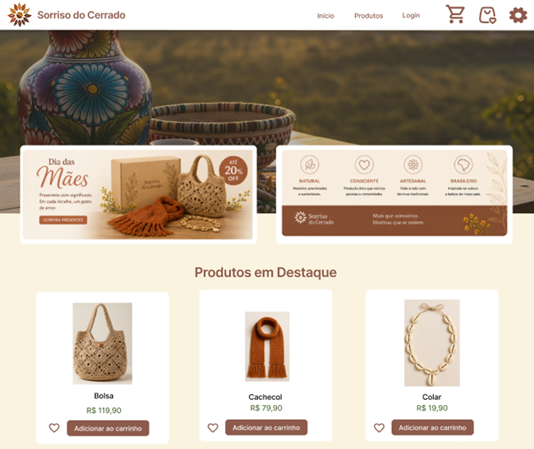
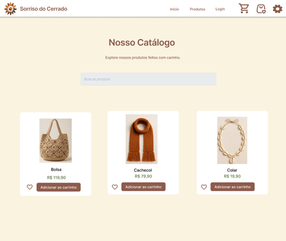
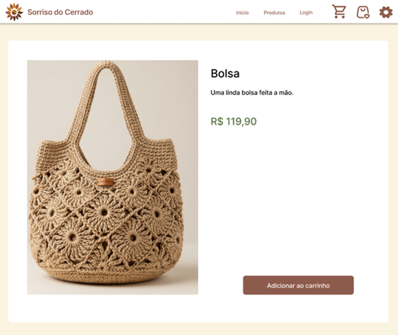
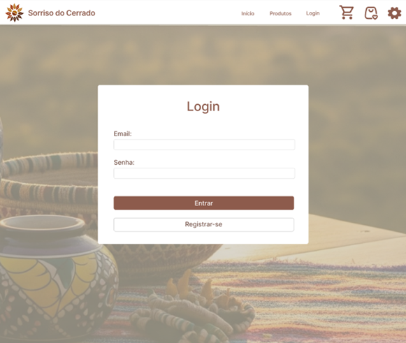
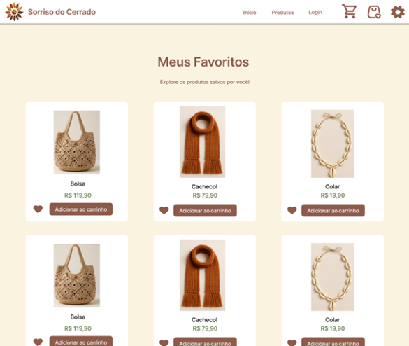
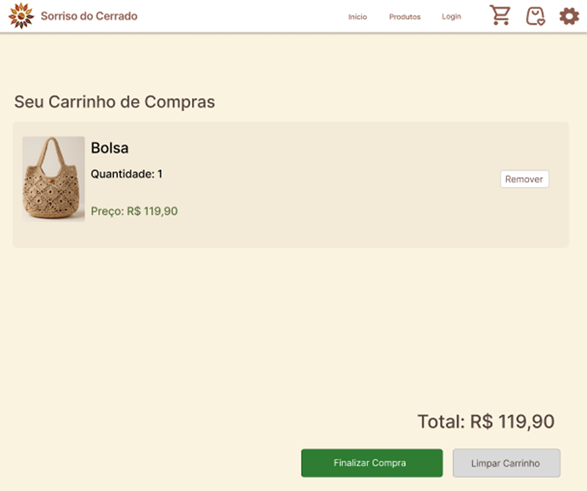
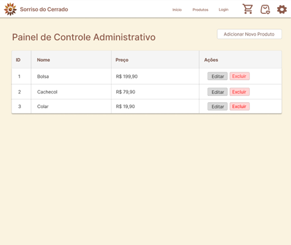
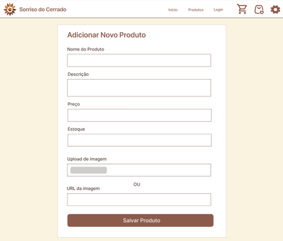

# Protótipos de Alta Fidelidade

Os protótipos de alta fidelidade foram desenhados na fase de concepção da interface para validar com a artesã e potenciais clientes os fluxos de navegação, a disposição dos elementos e a identidade visual.

---

## 1. Página Inicial (Home)
Destaca o banner promocional principal com mensagem de boas-vindas, chamada para ação (*CTA*) e vitrine com produtos em alta.

---

## 2. Catálogo de Produtos
Apresentação em grade responsiva com todos os artesanatos disponíveis, barra de pesquisa e filtros.

---

## 3. Detalhes do Produto
Página dedicada a uma peça específica com fotografia em alta resolução, descrição dos materiais, preço unitário e botão para adicionar ao carrinho.

---

## 4. Tela de Autenticação (Login)
Formulário limpo e objetivo para entrada de e-mail e senha, com link para recuperação e novo cadastro.

---

## 5. Meus Favoritos
Galeria personalizada contendo os produtos marcados com o ícone de coração pelo usuário autenticado.

---

## 6. Carrinho de Compras
Tela de revisão dos itens selecionados, permitindo alterar quantidades, visualizar o total consolidado e avançar para finalização.

---

## 7. Painel do Administrador
Área restrita da artesã com tabela completa de inventário, indicando IDs, descrições, preços e ações de edição e exclusão.

---

## 8. Adicionar Novo Produto
Formulário com campos intuitivos para inclusão de novos artesanatos no catálogo com upload de foto e quantidade em estoque.

