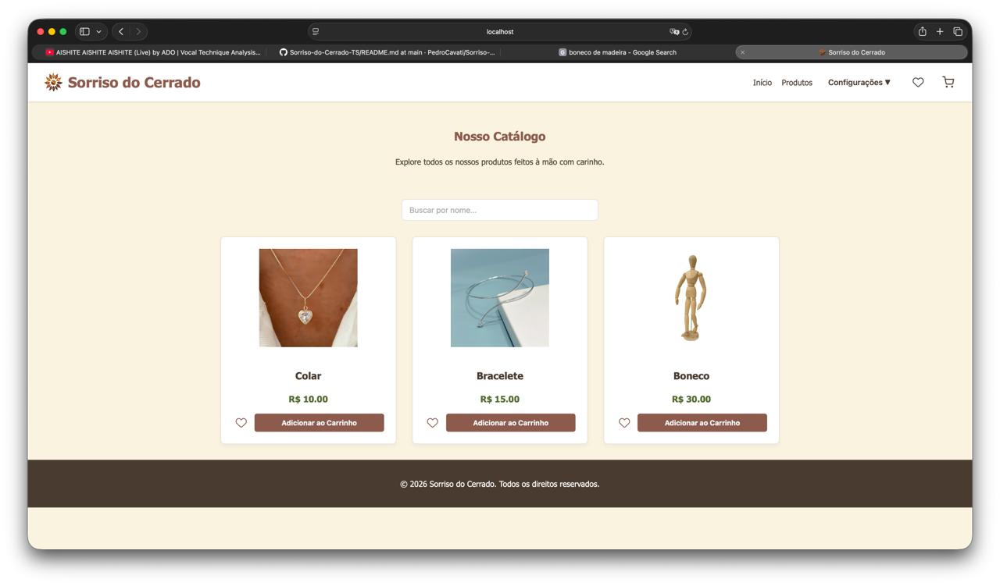
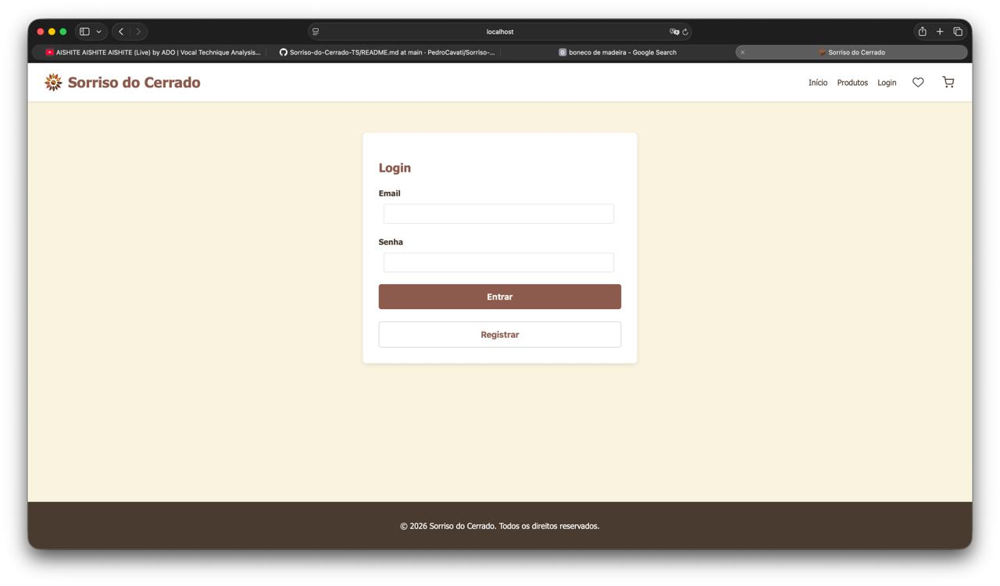
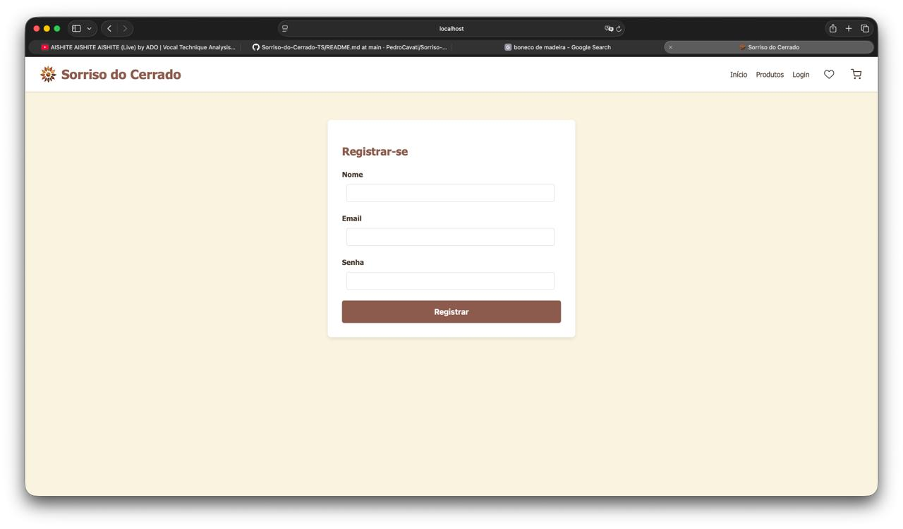
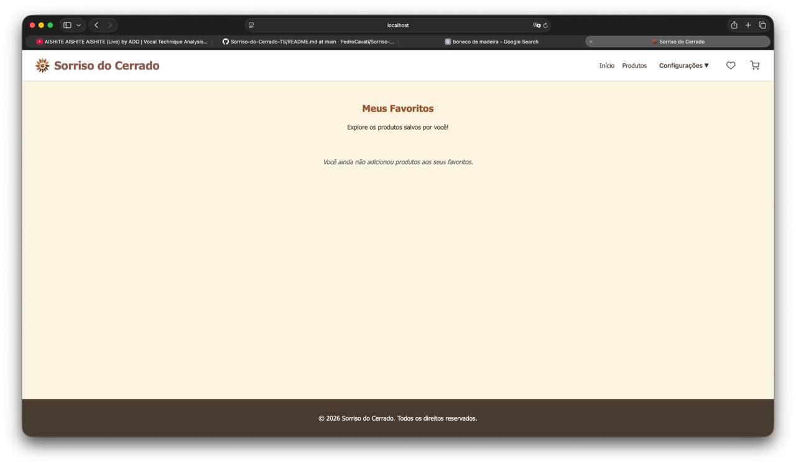
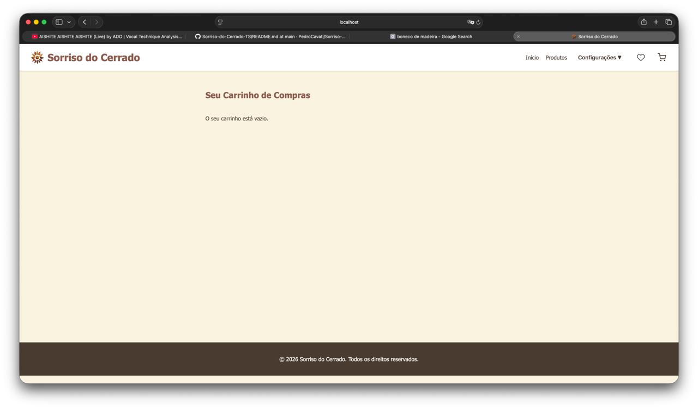
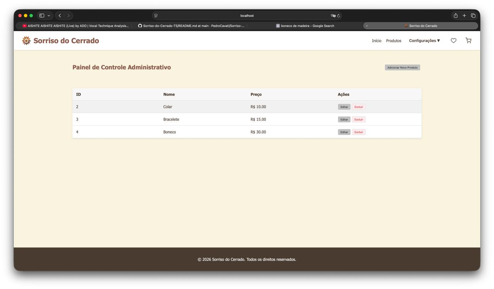
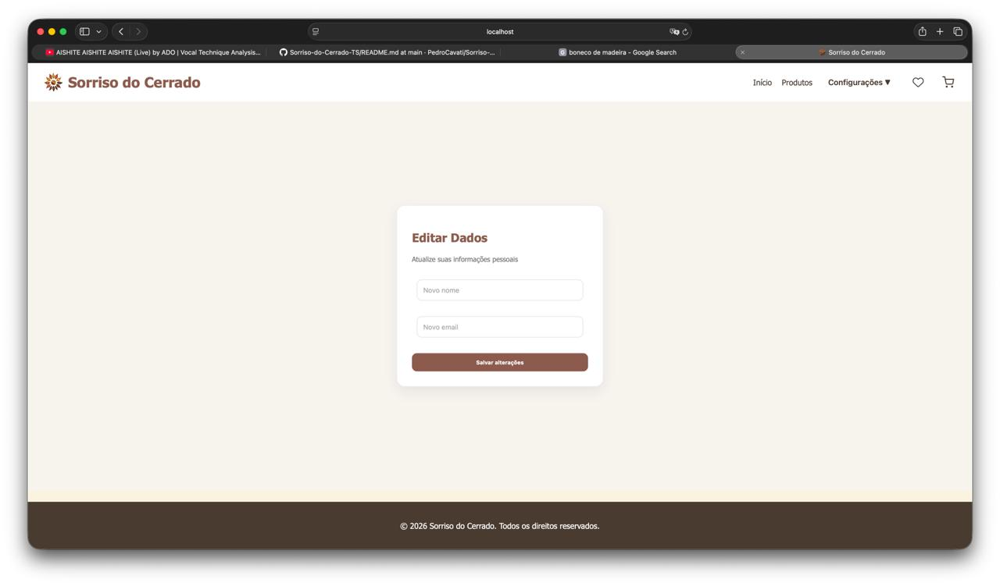
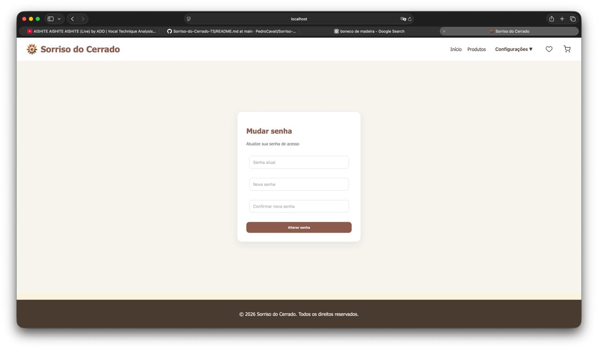

# Telas Implementadas da Aplicação

Esta seção apresenta capturas reais do sistema **Sorriso do Cerrado** construído e em execução, demonstrando a alta fidelidade entre o projeto conceitual de interface e o software entregue.

---

## 1. Página Inicial (Home)
Vitrine operacional com carrossel dinâmico de banners, produtos em destaque e rodapé institucional.

---

## 2. Catálogo de Produtos
Catálogo em funcionamento com carregamento dinâmico a partir da API REST e banco de dados MySQL.

---

## 3. Tela de Login
Interface de autenticação com validação de campos e feedback visual imediato.

---

## 4. Tela de Cadastro de Usuário
Formulário de criação de nova conta com validação de unicidade de e-mail.

---

## 5. Tela de Meus Favoritos
Visualização da lista de produtos favoritos persistida individualmente por cliente no banco de dados.

---

## 6. Carrinho de Compras
Fluxo de cálculo dinâmico de subtotais e controle de quantidades.

---

## 7. Painel de Controle Administrativo
Painel de gestão exclusivo da artesã com visualização tabular do catálogo e atalhos de manutenção.

---

## 8. Edição de Dados Pessoais
Página do perfil do usuário permitindo a atualização de nome, e-mail e contato telefônico.

---

## 9. Alteração de Senha
Formulário seguro para atualização de credenciais de acesso do usuário com checagem de senha atual e nova confirmação.

