# Galeria de Evidências dos Testes

Esta seção reúne as principais evidências fotográficas das execuções de testes unitários (Jest), testes de API (Postman) e testes End-to-End (Cypress).

---

## Evidências Principais de Execução

### 1. Execuções em Jest e Postman (Testes Unitários e API)

| Evidência | Descrição do Teste |
| :---: | :--- |
| 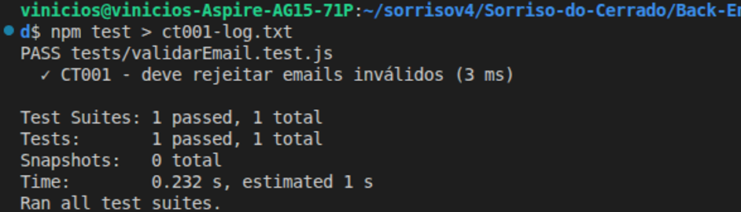 | **Figura 1:** Execução do teste unitário `validarEmail.test.js` no Jest com status **PASS**. |
| 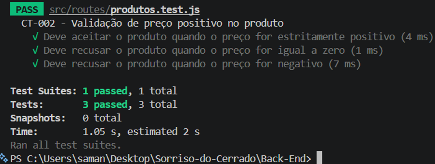 | **Figura 2:** Validação unitária de restrição para preços estritamente positivos. |
| 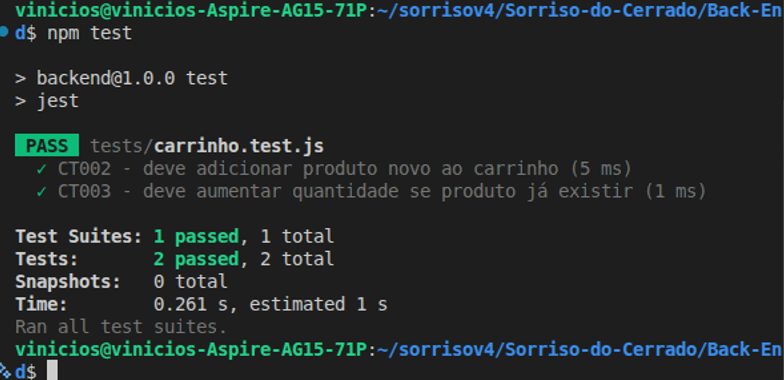 | **Figura 3:** Teste unitário de adição de novo item ao carrinho no Jest. |
| 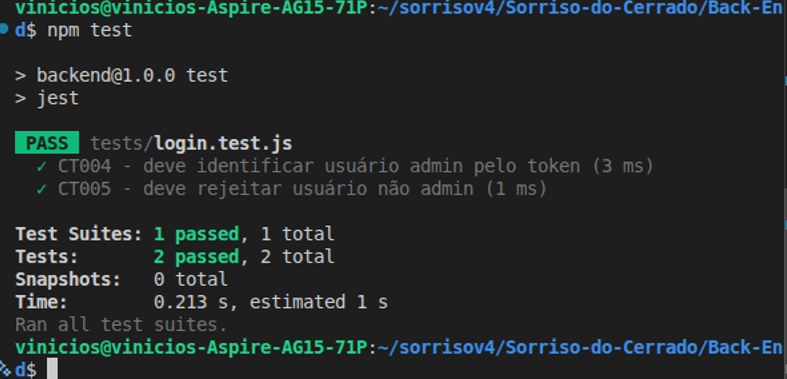 | **Figura 4:** Teste de incremento de quantidade de item já existente no carrinho. |
| 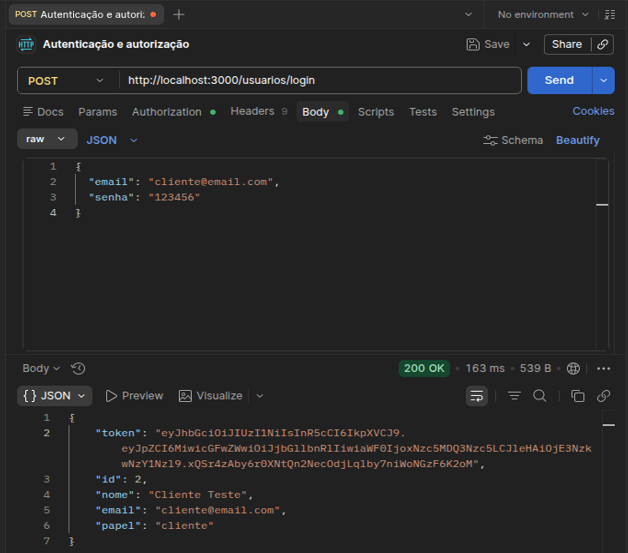 | **Figura 5:** Validação de privilégios de administrador via token JWT (`login.test.js`). |
| 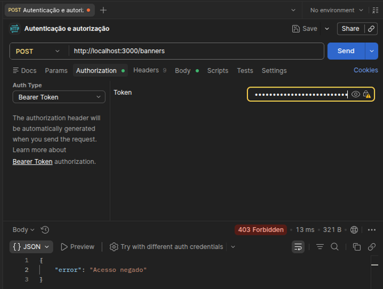 | **Figura 6:** Requisição Postman autenticando usuário cliente (HTTP 200). |
| 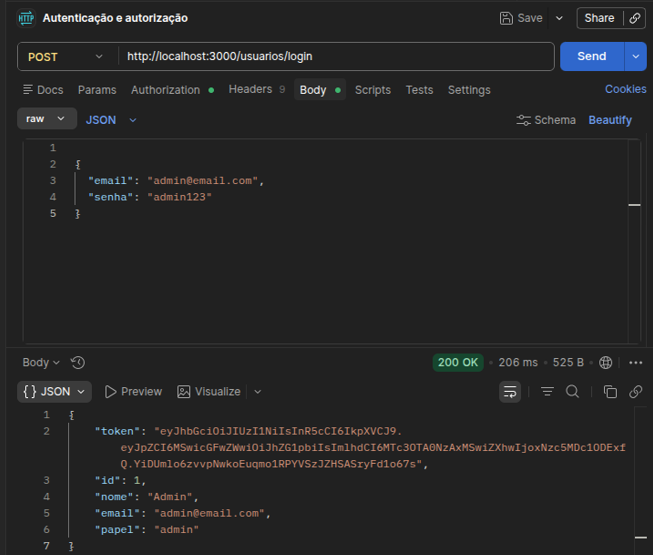 | **Figura 7:** Requisição Postman autenticando artesã administradora com permissões elevadas. |
| 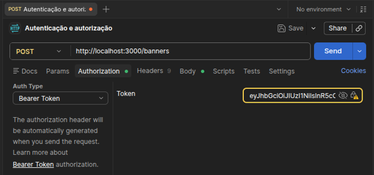 | **Figura 8:** Bloqueio de rota administrativa `/banners` para usuário cliente (HTTP 403 Forbidden). |
| 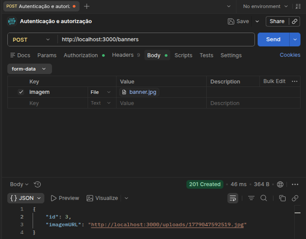 | **Figura 9:** Acesso autorizado à rota administrativa com token de administradora. |

---

### 2. Execuções em Cypress (Testes End-to-End no Navegador)

| Evidência | Descrição do Teste |
| :---: | :--- |
| 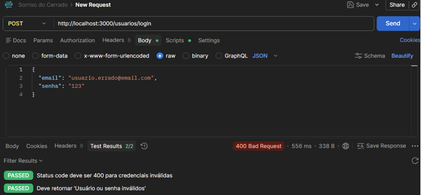 | **Figura 10:** Upload de imagem de banner via multipart form-data aprovado. |
| 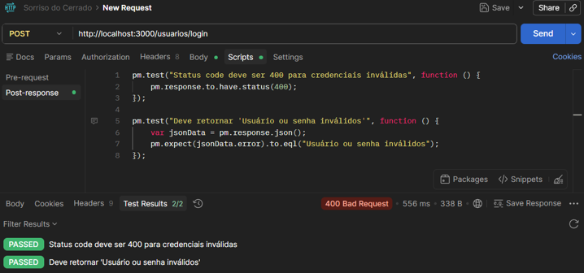 | **Figura 11:** Teste de validação de unicidade de e-mail ao atualizar perfil. |
| 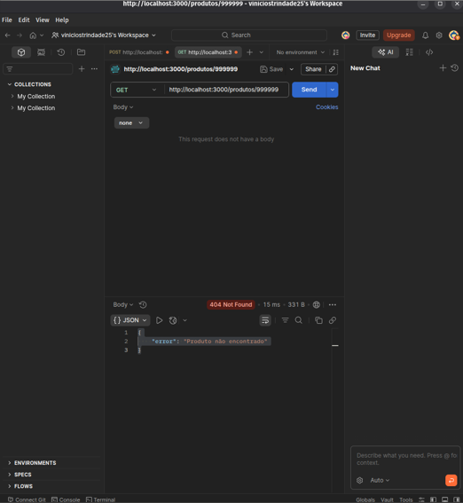 | **Figura 12:** Consulta a produto inexistente retornando 404 Not Found. |
| 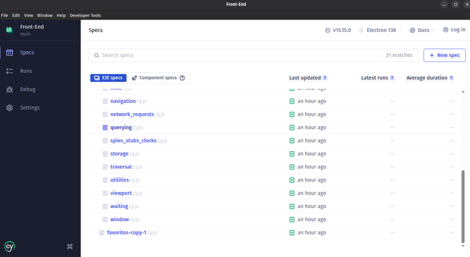 | **Figura 13:** Cypress Test Runner aberto executando suíte de testes. |
| 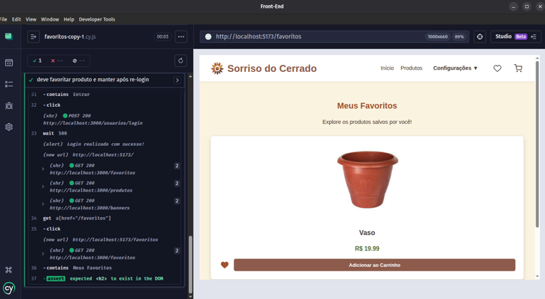 | **Figura 14:** Execução aprovada do teste de favoritos persistentes (`favoritos-copy-1.cy.js`). |
| 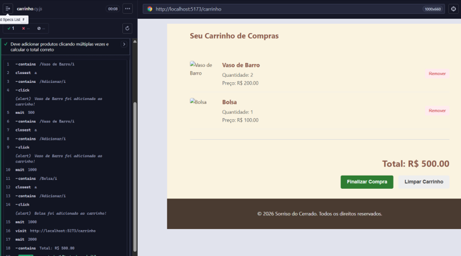 | **Figura 15:** Validação Cypress de cálculo de soma do carrinho de compras. |
|  | **Figura 16:** Teste de navegação até o catálogo via navbar (`detalhesProduto.cy.js`). |
| 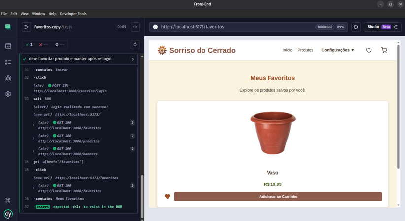 | **Figura 17:** Teste completo do fluxo do carrinho de compras via Cypress. |
| 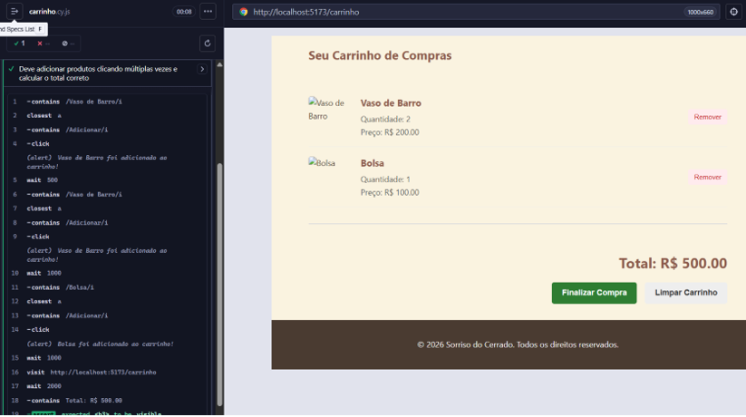 | **Figura 18:** Resumo consolidado de todas as suítes Cypress com 100% de sucesso. |

---

## Evidências Completas (Apêndice Geral)
Para visualização de todas as 39 capturas de tela do apêndice integral dos testes, consulte os arquivos disponíveis no diretório de ativos: `docs/assets/evidencias/completas/`.
