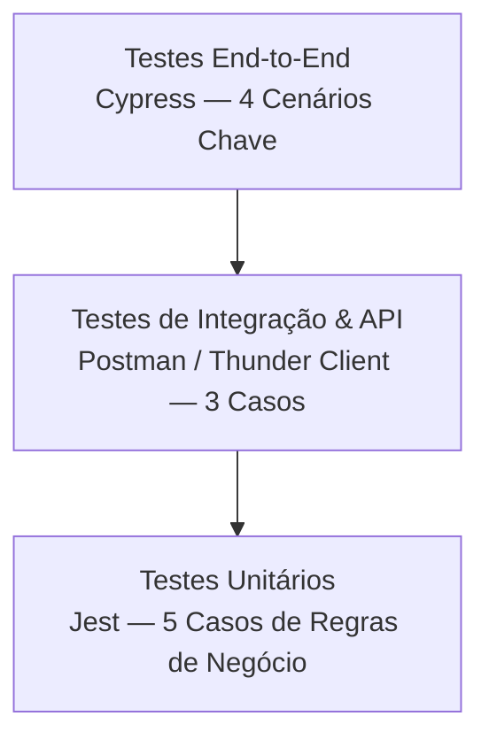

# Plano e Estratégia de Testes de Software

**Documento Base:** Relatório de Testes de Software — Sorriso do Cerrado  
**Objetivo:** Garantir a qualidade, segurança, estabilidade e conformidade funcional do e-commerce Sorriso do Cerrado.

---

## 1. Escopo dos Testes

### 1.1 Dentro do Escopo (Testado)
* Regras centrais de negócio (validação de formato de e-mail, restrição de preços estritamente positivos).
* Lógica e estado do carrinho de compras (inserção de novo produto, incremento de quantidades, recálculo de totais).
* Autenticação e autorização via API (geração de tokens JWT, bloqueio de rotas protegidas sem credenciais, verificação de perfil administrador).
* Operações de atualização de perfil e garantia de unicidade de e-mail.
* Fluxos ponta a ponta (E2E) no navegador: listagem de catálogo, persistência de favoritos após login e ciclo completo de carrinho.

### 1.2 Fora do Escopo (Não Testado nesta Fase)
* Testes de carga massiva com milhares de usuários simultâneos (cenário além da demanda inicial da artesã).
* Gateway de pagamento bancário automatizado (substituído pelo canal direto de fechamento via WhatsApp).

---

## 2. Pirâmide de Testes e Ferramentas

A estratégia de testes seguiu o modelo clássico da pirâmide de testes para garantir cobertura ampla com excelente custo-benefício:

| Nível de Teste | Ferramenta | Foco Principal |
| :--- | :--- | :--- |
| **Unitário** | **Jest** | Validação isolada de funções críticas do back-end em milissegundos sem depender de banco de dados ou rede. |
| **Integração / API** | **Postman / Thunder Client** | Validação dos contratos HTTP, cabeçalhos JWT, códigos de status (200, 201, 400, 403, 404) e payloads JSON. |
| **End-to-End (E2E)** | **Cypress** | Simulação realista da interação do cliente no navegador (cliques, digitação, navegação entre páginas e persistência no localStorage). |

---

## 3. Ambiente e Matriz de Responsabilidades

* **Ambiente de Testes:** Sistema operacional Windows 11 com Node.js v20+, banco MySQL local em contêiner Docker e navegadores Chromium / Chrome.
* **Responsabilidades:**
    * **Samantha Yumi Tanaka & Vinicios Trindade Costa:** Criação dos planos, codificação dos testes automatizados em Jest e Cypress e execução dos cenários de API.
    * **Pedro Henrique Cavalcante, Pedro Henrique Nunes, Samuel Batista e Wictor Emanoel:** Testes exploratórios manuais, elaboração de evidências, validação de usabilidade e documentação dos defeitos.
